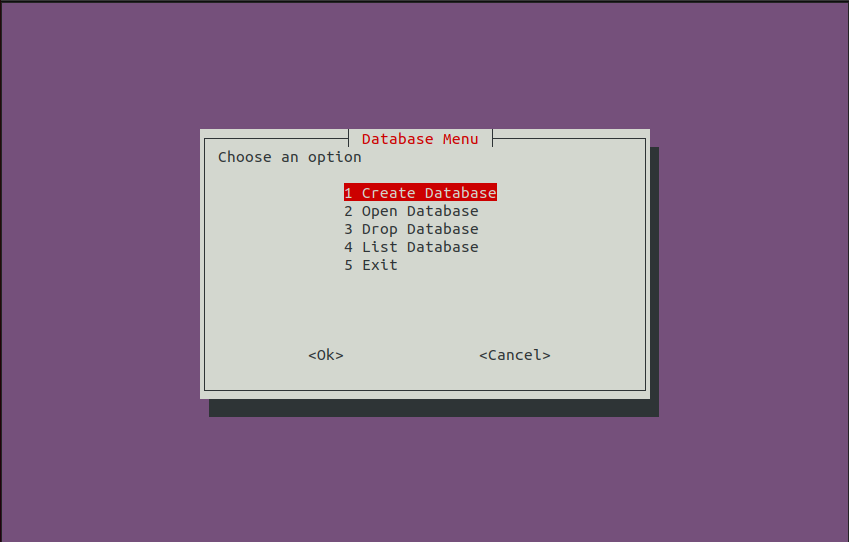

# Project Name

DBMS-Bash

# Project Description

 Database Management System using Bash scripting with very simple GUI..
 In this simple DBMS you will find **3 Levels:**
 
**(1) Database Level:** 
  - Create Database
  - Open DataBase
  - Drop Database
  - List Database
  - Exit
  
**(2) Table Level:**
  - List All Tables
  - Open Certain Table
  - Drop Table
  - Back To DB Menu
  - Exit
  
**(3) Record Level:** 
  - Show table
  - Insert New Record
  - Delete Record
  - Update Certain Cell
  - Back to Tables Menu
  - Exit
  
  # General Instructions
  * In this simple GUI you will use *Arrows Keys*.
  * If you are in *Show table* option (in the record level) .. to press *Ok* .. you will need to press *Tab* first and then press *Ok*.
  
  ***DBMS will prevent u to do the following:***
  - Enter (0) in the *primary key* field.
  - Enter dublicate *primary key*.
  - Insert DB name or Table name that you already added *(Ex: Two DBs with the same name)*.
  
